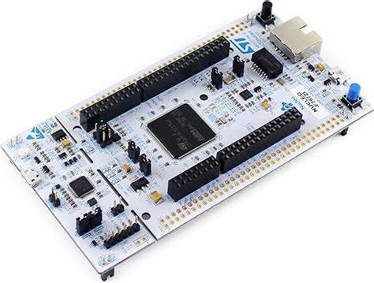

# **soHome**

| **Project name** | soHome                                                                                                           |
|:-----------------|:-----------------------------------------------------------------------------------------------------------------|
| **Authors**      | 30841 - Orlando Kevin Gurrola <br> 34715 - Caitlin Murillo Denisse Espinoza <br> 34735 - Ricardo Nieblas Cabrera |
| **Editor**       | Dr. Adán Hirales Carbajal                                                                                        |
| **Last update**  | Dec. 4th 2023                                                                                                    |

## **Index**

1. [Problem statement](#problem-statement)
2. [Hardware requirements](#hardware-requirements)
3. [Hardware schematic](#hardware-schematic)
4. [Hardware layout](#hardware-layout)
5. [STM32 CubeMX parameters](#stm32-cubemx-parameters)
6. [Software components](#software-components)

### **Problem statement**

Automated house management systems are becoming increasingly popular, with many companies offering their own solutions. However, these systems can be expensive, require a lot of additional hardware, and are often limited to the products of a single company.

In this project, we propose an alternative to these systems, with the main goal in mind to make it as easy to use as possible, as well as providing security for our users. Our system will consist of a local machine, which means that there will be no need for an internet connection. Additionally, our system will be open source, which means that users will be able to modify it to their liking, as well as being able to add new features to it.

We have plans for the future to keep adding new features to our system, to solidify our project as a product that everybody can use, and to provide all documentation necessary to get the system up and running.

### **Hardware requirements**

We will provide purchase links to all these components if you intend to follow along with our project. Please do keep in mind this was developed in Mexico, so these links will be for Mexican stores. If you are from another country, you will have to look for these components in your local stores.

<br>

| Component                                                                                                     | Quantity | Characteristics                                                                                                                                                                     | Component                                              |
|:--------------------------------------------------------------------------------------------------------------|:---------|:------------------------------------------------------------------------------------------------------------------------------------------------------------------------------------|:-------------------------------------------------------|
| [STM32 F767ZI](https://www.st.com/en/evaluation-tools/nucleo-f767zi.html)                                     | 1        | <li> Powerful STM microcontroller <li> Versatile development board for embedded projects <li> Supports various input/output options <li> Integrated debugging and programming tools |            |
| [Movement sensor (PIR)](https://www.steren.com.mx/sensor-de-movimiento-pir.html)                              | 2        | <li> 4m detection distance <li> Simple or continuous pulse <li> Adjustable delay                                                                                                    |  |
| [Buzzer](https://www.steren.com.mx/buzzer-de-3-3-khz-de-8-a-15-vcc-con-se-al-de-tono-constante-de-85-db.html) | 1        | <li> Oscillatory frequency: 3.3 kHz <li> Operating voltage: 8 to 15 Vdc <li> Sound pressure level: 85 dB                                                                            |                   |

### **Hardware schematic**


### **Hardware layout**

|  |  |
|:----------------------------------------:|:----------------------------------------:|

### **STM32 CubeMX parameters**

| Class               | Attribute                          | Value                                       |
|:--------------------|:-----------------------------------|:--------------------------------------------|
| Project             | Name                               | F767ZI                                      |
|                     | Clock                              | 16Mhz                                       |
|                     | Timebase source                    | SysTick                                     |
| STM32 Pins          | PD0-PD7, PB0,PA0                   | PD0-PD7 (GPIO_OUTPUT), PB0-PA0 (GPIO_INPUT) |
| FreeRTOS            | API                                | CMSIS v1                                    |
| Task/interrupt      | Name                               |                                             |
| 3 (Type Persistent) | Sensor IN 1, Sensor In 2, GPIO_OUT | Priority low                                |
| 2 (Type Interrupt)  | Sensor Interrupt 1 and 2           | Priority normal                             |

### **Software components**

#### **General code summary**

This code is intended to be run on an STM32 microcontroller. It includes the main function that is the entry point of the program and some initialization functions.

1. `main()`: This function initializes the microcontroller, configures the system clock, and initializes the GPIOs. It then enters an infinite loop where it checks the state of two GPIO pins (GPIOA_PIN_0 and GPIOB_PIN_0). Depending on the state of these pins, it sets or resets certain other pins on GPIOD and introduces delays.

2. `SystemClock_Config()`: This function configures the system clock of the microcontroller.

3. `MX_GPIO_Init()`: This function initializes the GPIOs. It sets the mode of GPIOA_PIN_0 and GPIOB_PIN_0 as input and GPIOD_PIN_0 to GPIOD_PIN_7 as output. It also sets the initial output level of GPIOD_PIN_0 to GPIOD_PIN_7 as low (reset state).

4. `MPU_Config()`: This function configures the Memory Protection Unit (MPU) of the microcontroller. It disables the MPU, configures a region, and then enables the MPU.

5. `Error_Handler()`: This function is called when an error occurs. It disables interrupts and enters an infinite loop.

6. `assert_failed()`: This function is called when an assert fails. It's empty and can be filled with user-specific code.

```c
#include "main.h"

void SystemClock_Config(void);
static void MPU_Config(void);
static void MX_GPIO_Init(void);

int main(void) {
  MPU_Config();
  HAL_Init();
  SystemClock_Config();
  MX_GPIO_Init();
  
  while (1) {
	  if (HAL_GPIO_ReadPin(GPIOA, GPIO_PIN_0) == GPIO_PIN_SET) {
		  HAL_GPIO_WritePin(GPIOD, GPIO_PIN_0, GPIO_PIN_SET);
		  HAL_GPIO_WritePin(GPIOD, GPIO_PIN_2, GPIO_PIN_SET);
		  HAL_Delay(500);
	  } else {
		  HAL_GPIO_WritePin(GPIOD, GPIO_PIN_0, GPIO_PIN_RESET);
		  HAL_GPIO_WritePin(GPIOD, GPIO_PIN_2, GPIO_PIN_RESET);
	  }
	  if (HAL_GPIO_ReadPin(GPIOB, GPIO_PIN_0) == GPIO_PIN_SET) {
		  HAL_GPIO_WritePin(GPIOD, GPIO_PIN_1, GPIO_PIN_SET);
		  HAL_GPIO_WritePin(GPIOD, GPIO_PIN_3, GPIO_PIN_SET);
		  HAL_Delay(500);
		  HAL_GPIO_WritePin(GPIOD, GPIO_PIN_3, GPIO_PIN_RESET);
		  HAL_Delay(500);
		  HAL_GPIO_WritePin(GPIOD, GPIO_PIN_3, GPIO_PIN_SET);
		  HAL_Delay(500);
		  HAL_GPIO_WritePin(GPIOD, GPIO_PIN_3, GPIO_PIN_RESET);
		  HAL_Delay(500);
		  HAL_GPIO_WritePin(GPIOD, GPIO_PIN_3, GPIO_PIN_SET);
		  HAL_Delay(500);
		  HAL_GPIO_WritePin(GPIOD, GPIO_PIN_3, GPIO_PIN_RESET);
		  HAL_Delay(500);
		  HAL_GPIO_WritePin(GPIOD, GPIO_PIN_3, GPIO_PIN_SET);
	  } else {
		  HAL_GPIO_WritePin(GPIOD, GPIO_PIN_1, GPIO_PIN_RESET);
		  HAL_GPIO_WritePin(GPIOD, GPIO_PIN_3, GPIO_PIN_RESET);
	  }
  }
}

void SystemClock_Config(void) {
  RCC_OscInitTypeDef RCC_OscInitStruct = {0};
  RCC_ClkInitTypeDef RCC_ClkInitStruct = {0};

  __HAL_RCC_PWR_CLK_ENABLE();
  __HAL_PWR_VOLTAGESCALING_CONFIG(PWR_REGULATOR_VOLTAGE_SCALE3);

  RCC_OscInitStruct.OscillatorType = RCC_OSCILLATORTYPE_HSI;
  RCC_OscInitStruct.HSIState = RCC_HSI_ON;
  RCC_OscInitStruct.HSICalibrationValue = RCC_HSICALIBRATION_DEFAULT;
  RCC_OscInitStruct.PLL.PLLState = RCC_PLL_NONE;
  if (HAL_RCC_OscConfig(&RCC_OscInitStruct) != HAL_OK) {
    Error_Handler();
  }

  RCC_ClkInitStruct.ClockType = RCC_CLOCKTYPE_HCLK|RCC_CLOCKTYPE_SYSCLK
                              |RCC_CLOCKTYPE_PCLK1|RCC_CLOCKTYPE_PCLK2;
  RCC_ClkInitStruct.SYSCLKSource = RCC_SYSCLKSOURCE_HSI;
  RCC_ClkInitStruct.AHBCLKDivider = RCC_SYSCLK_DIV1;
  RCC_ClkInitStruct.APB1CLKDivider = RCC_HCLK_DIV1;
  RCC_ClkInitStruct.APB2CLKDivider = RCC_HCLK_DIV1;

  if (HAL_RCC_ClockConfig(&RCC_ClkInitStruct, FLASH_LATENCY_0) != HAL_OK) {
    Error_Handler();
  }
}

static void MX_GPIO_Init(void) {
  GPIO_InitTypeDef GPIO_InitStruct = {0};

  __HAL_RCC_GPIOA_CLK_ENABLE();
  __HAL_RCC_GPIOB_CLK_ENABLE();
  __HAL_RCC_GPIOD_CLK_ENABLE();

  HAL_GPIO_WritePin(GPIOD, GPIO_PIN_0|GPIO_PIN_1|GPIO_PIN_2|GPIO_PIN_3
                          |GPIO_PIN_4|GPIO_PIN_5|GPIO_PIN_6|GPIO_PIN_7, GPIO_PIN_RESET);

  GPIO_InitStruct.Pin = GPIO_PIN_0;
  GPIO_InitStruct.Mode = GPIO_MODE_INPUT;
  GPIO_InitStruct.Pull = GPIO_NOPULL;
  HAL_GPIO_Init(GPIOA, &GPIO_InitStruct);

  GPIO_InitStruct.Pin = GPIO_PIN_0;
  GPIO_InitStruct.Mode = GPIO_MODE_INPUT;
  GPIO_InitStruct.Pull = GPIO_NOPULL;
  HAL_GPIO_Init(GPIOB, &GPIO_InitStruct);

  GPIO_InitStruct.Pin = GPIO_PIN_0|GPIO_PIN_1|GPIO_PIN_2|GPIO_PIN_3
                          |GPIO_PIN_4|GPIO_PIN_5|GPIO_PIN_6|GPIO_PIN_7;
  GPIO_InitStruct.Mode = GPIO_MODE_OUTPUT_PP;
  GPIO_InitStruct.Pull = GPIO_NOPULL;
  GPIO_InitStruct.Speed = GPIO_SPEED_FREQ_LOW;
  HAL_GPIO_Init(GPIOD, &GPIO_InitStruct);
}

void MPU_Config(void) {
  MPU_Region_InitTypeDef MPU_InitStruct = {0};

  HAL_MPU_Disable();

  MPU_InitStruct.Enable = MPU_REGION_ENABLE;
  MPU_InitStruct.Number = MPU_REGION_NUMBER0;
  MPU_InitStruct.BaseAddress = 0x0;
  MPU_InitStruct.Size = MPU_REGION_SIZE_4GB;
  MPU_InitStruct.SubRegionDisable = 0x87;
  MPU_InitStruct.TypeExtField = MPU_TEX_LEVEL0;
  MPU_InitStruct.AccessPermission = MPU_REGION_NO_ACCESS;
  MPU_InitStruct.DisableExec = MPU_INSTRUCTION_ACCESS_DISABLE;
  MPU_InitStruct.IsShareable = MPU_ACCESS_SHAREABLE;
  MPU_InitStruct.IsCacheable = MPU_ACCESS_NOT_CACHEABLE;
  MPU_InitStruct.IsBufferable = MPU_ACCESS_NOT_BUFFERABLE;

  HAL_MPU_ConfigRegion(&MPU_InitStruct);
  HAL_MPU_Enable(MPU_PRIVILEGED_DEFAULT);

}

void Error_Handler(void) {
  __disable_irq();
  while (1) { }
}

#ifdef  USE_FULL_ASSERT

void assert_failed(uint8_t *file, uint32_t line) { }

#endif
```

#### **Code for PIR sensors**

The code for the PIR sensors is a part of the infinite loop in the `main()` function. It checks the state of two GPIO pins and based on their state, it toggles the state of certain other GPIO pins on GPIOD.

```c
  while (1) {
	  if (HAL_GPIO_ReadPin(GPIOA, GPIO_PIN_0) == GPIO_PIN_SET) {
		  HAL_GPIO_WritePin(GPIOD, GPIO_PIN_0, GPIO_PIN_SET);
		  HAL_GPIO_WritePin(GPIOD, GPIO_PIN_2, GPIO_PIN_SET);
		  HAL_Delay(500);
	  } else {
		  HAL_GPIO_WritePin(GPIOD, GPIO_PIN_0, GPIO_PIN_RESET);
		  HAL_GPIO_WritePin(GPIOD, GPIO_PIN_2, GPIO_PIN_RESET);
	  }
	  if (HAL_GPIO_ReadPin(GPIOB, GPIO_PIN_0) == GPIO_PIN_SET) {
		  HAL_GPIO_WritePin(GPIOD, GPIO_PIN_1, GPIO_PIN_SET);
		  HAL_GPIO_WritePin(GPIOD, GPIO_PIN_3, GPIO_PIN_SET);
		  HAL_Delay(500);
		  HAL_GPIO_WritePin(GPIOD, GPIO_PIN_3, GPIO_PIN_RESET);
		  HAL_Delay(500);
		  HAL_GPIO_WritePin(GPIOD, GPIO_PIN_3, GPIO_PIN_SET);
		  HAL_Delay(500);
		  HAL_GPIO_WritePin(GPIOD, GPIO_PIN_3, GPIO_PIN_RESET);
		  HAL_Delay(500);
		  HAL_GPIO_WritePin(GPIOD, GPIO_PIN_3, GPIO_PIN_SET);
		  HAL_Delay(500);
		  HAL_GPIO_WritePin(GPIOD, GPIO_PIN_3, GPIO_PIN_RESET);
		  HAL_Delay(500);
		  HAL_GPIO_WritePin(GPIOD, GPIO_PIN_3, GPIO_PIN_SET);
	  } else {
		  HAL_GPIO_WritePin(GPIOD, GPIO_PIN_1, GPIO_PIN_RESET);
		  HAL_GPIO_WritePin(GPIOD, GPIO_PIN_3, GPIO_PIN_RESET);
	  }
  }
```